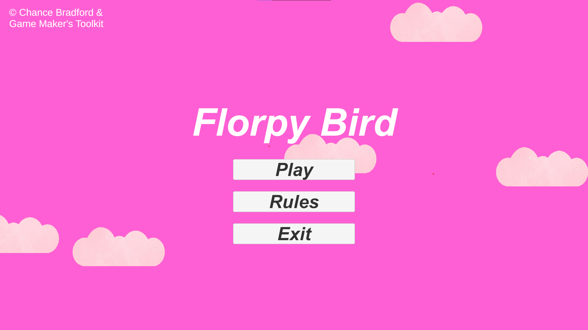

# Florpy Bird

A comprehensive Unity 2D recreation of the popular mobile game Flappy Bird, featuring polished gameplay mechanics, animations, and sound effects designed for Windows desktop.

## Features

- **Complete Flappy Bird Recreation**: Faithful adaptation of the classic mobile game with smooth 2D gameplay
- **Main Menu System**: Intuitive main menu with game rules and comprehensive instructions
- **Enhanced Gameplay**: Fluid animations and immersive sound effects for an engaging experience
- **Scoring System**: Real-time point counter and high score tracking
- **Game Over Screen**: Detailed game over interface with score display and restart options
- **Windows Compatibility**: Optimized for Windows 10 and Windows 11 machines

## Screenshots

### Main Menu

### Gameplay

### Game Over Screen

### High Score Display

### Game Rules

*All screenshots showcase the game's interface, animations, and visual design*

## How to Run

1. Download the game zip file from the releases section
2. Extract the contents to your desired location
3. Run `FlorpyBird.exe` to start the game
4. Enjoy playing!

## System Requirements

- **OS**: Windows 10 or Windows 11
- **Platform**: Desktop/PC

## Development

This project was developed using Unity 2D as a personal project to recreate and enhance the classic Flappy Bird experience for desktop platforms.
