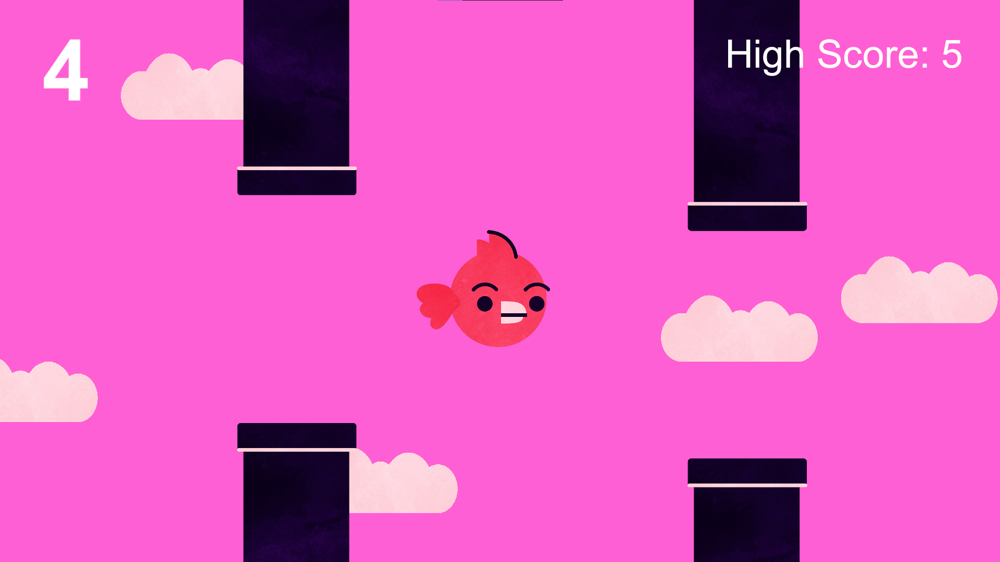
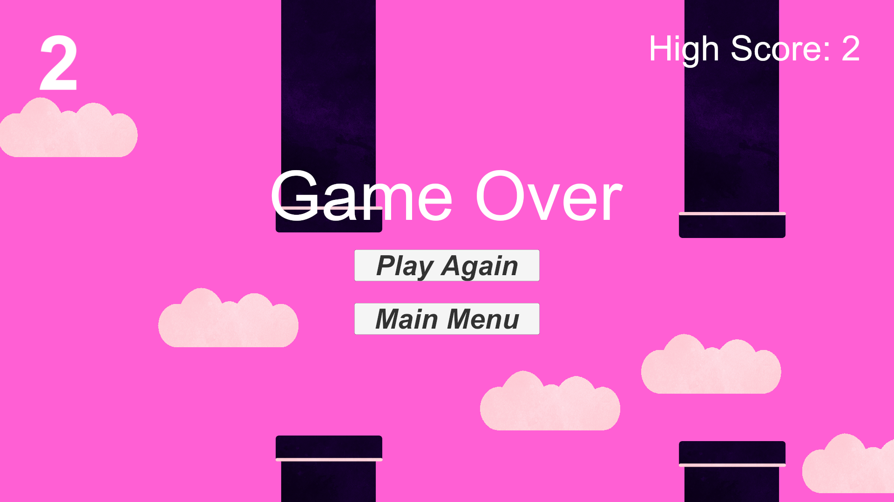
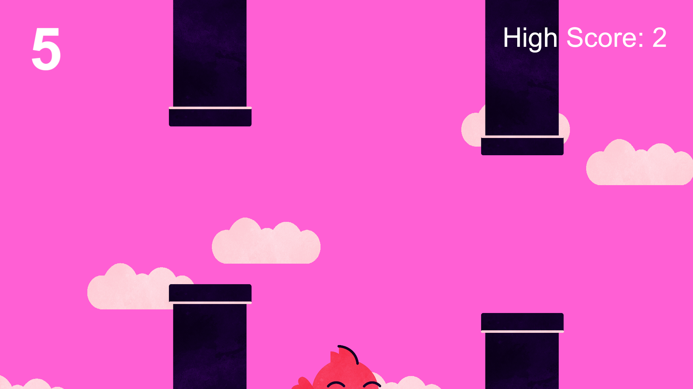
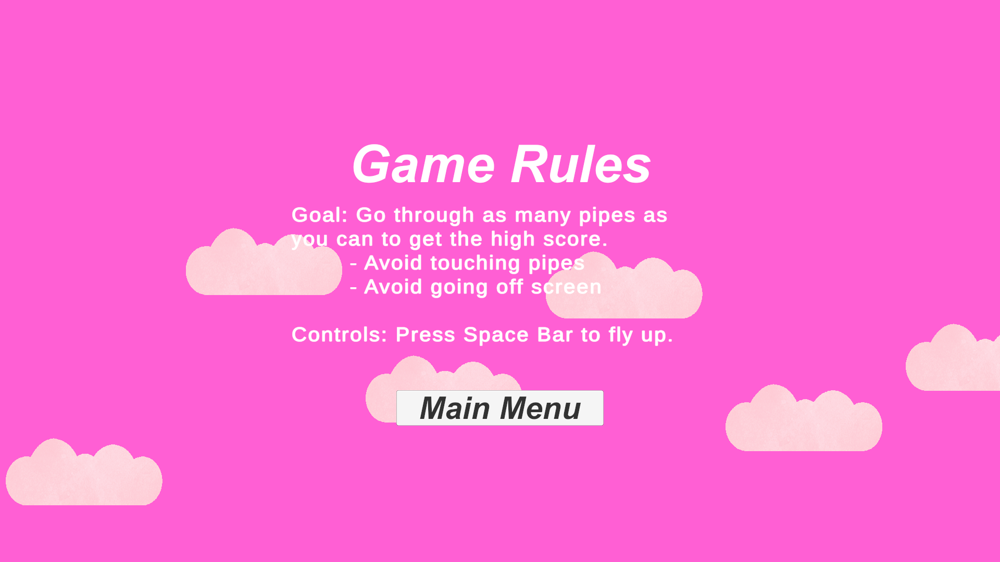

# Florpy Bird

A comprehensive Unity 2D recreation of the popular mobile game Flappy Bird, featuring polished gameplay mechanics, animations, and sound effects designed for Windows desktop.

## Features

- **Complete Flappy Bird Recreation**: Faithful adaptation of the classic mobile game with smooth 2D gameplay
- **Main Menu System**: Intuitive main menu with game rules and comprehensive instructions
- **Enhanced Gameplay**: Fluid animations and immersive sound effects for an engaging experience
- **Scoring System**: Real-time point counter and high score tracking
- **Game Over Screen**: Detailed game over interface with score display and restart options
- **Windows Compatibility**: Optimized for Windows 10 and Windows 11 machines

## Screenshots

### Main Menu

### Gameplay

### Game Over Screen

### High Score Display

### Game Rules

*All screenshots showcase the game's interface, animations, and visual design*

## Download & Installation

### Latest Release

1. **Download**: Go to the [Releases](https://github.com/Chanceb1/FlorpyBird/releases) page and download the latest `FlorpyBird-vX.X.X.zip` file
2. **Extract**: Unzip the downloaded file to your desired location on your computer
3. **Run**: Double-click `FlorpyBird.exe` to launch the game
4. **Play**: Use spacebar or mouse click to make the bird fly and avoid the pipes!

### Controls
- **Spacebar** or **Left Mouse Click**: Make the bird flap/fly
- **ESC**: Pause game or return to main menu

## System Requirements

- **OS**: Windows 10 or Windows 11
- **Platform**: Desktop/PC

## Development

This project was developed using Unity 2D as a personal project to recreate and enhance the classic Flappy Bird experience for desktop platforms.
